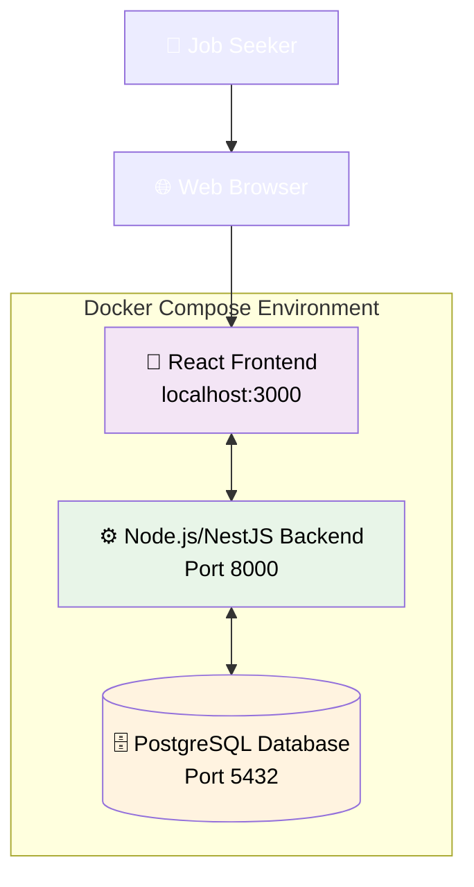
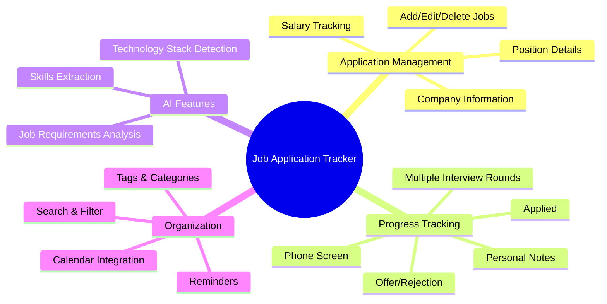
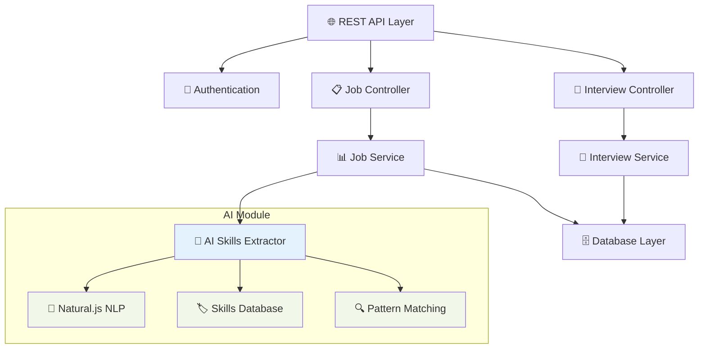
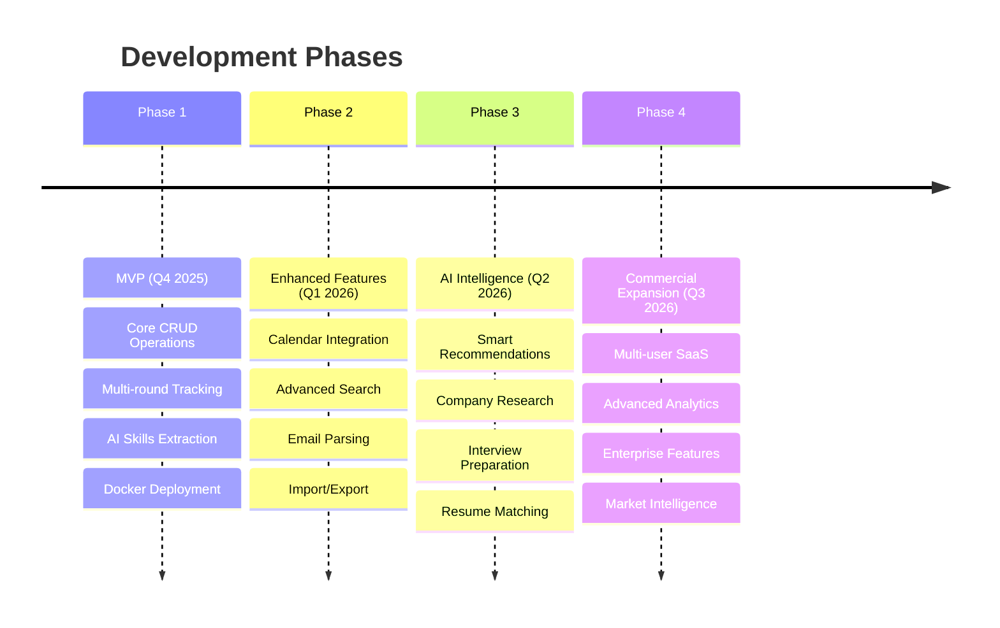

# AI Job Application Tracker

A Docker-based system for job seekers to track the application process with AI-powered skills extraction.

> 🚧 **Under Development** - Currently building requirements and architecture design.

## 🏗️ System Architecture

## ✨ Key Features

- **📊 Multi-Round Interview Tracking**: Detailed hiring process timeline with notes
- **🤖 AI Skills Extraction**: Automatically identify required skills from job descriptions  
- **🔒 Privacy-First**: Local deployment with Docker - your data stays on your machine
- **📅 Calendar Integration**: Schedule interviews and set reminders
- **🔍 Smart Search & Filter**: Find applications by company, status, skills, and more

## 🎯 Core Capabilities

## 🔧 Backend Architecture

## 🚀 Technology Stack

| Component | Technology | Purpose |
|-----------|------------|---------|
| **Frontend** | React + Tailwind CSS | User interface and experience |
| **Backend** | Node.js/NestJS | API and business logic |
| **Database** | PostgreSQL | Data persistence |
| **AI Engine** | Natural.js + future GPT integration | Skills extraction and analysis |
| **Deployment** | Docker Compose | Easy local setup |

## 📚 Documentation

| Document | Description |
|----------|-------------|
| [📋 Requirements](docs/REQUIREMENTS.md) | Detailed project requirements and specifications |
| [🏗️ Architecture](docs/architecture.md) | System design and technical architecture *(Coming Soon)* |
| [🚀 Getting Started](docs/getting-started.md) | Installation and setup guide *(Coming Soon)* |
| [🤝 Contributing](CONTRIBUTING.md) | How to contribute to the project *(Coming Soon)* |

## 🗺️ Development Roadmap

## 🎯 Project Vision

As a job seeker, managing hundreds of applications becomes overwhelming. Traditional tools like Excel spreadsheets are inadequate for complex hiring workflows. This project aims to create an intuitive system that:

- **Centralizes** all job application information
- **Tracks** multi-round interview processes  
- **Extracts** key requirements using AI
- **Protects** your privacy with local deployment

[📋 Read full project background](docs/REQUIREMENTS.md#12-background--motivation)

## 🔄 Current Status

- ✅ Requirements documentation complete
- 🚧 Architecture design in progress  
- ⏳ Frontend development starting soon
- ⏳ Backend API design
- ⏳ Database schema design

## 🤝 Contributing

This is an open-source project and contributions are welcome! Whether you're interested in:

- 🎨 **Frontend Development** (React/TypeScript)
- ⚙️ **Backend Development** (Node.js/NestJS) 
- 🤖 **AI Integration** (NLP/Skills Extraction)
- 📖 **Documentation** (Technical writing)
- 🧪 **Testing** (Unit/Integration tests)

[📋 View detailed feature requirements](docs/REQUIREMENTS.md#4-functional-requirements)

## 📄 License

MIT License - feel free to use this project for personal or commercial purposes.

---

**🚀 Star this repo if you find it useful!** Your support helps prioritize development.
